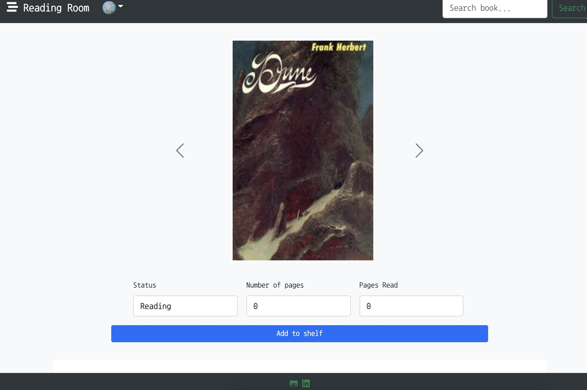
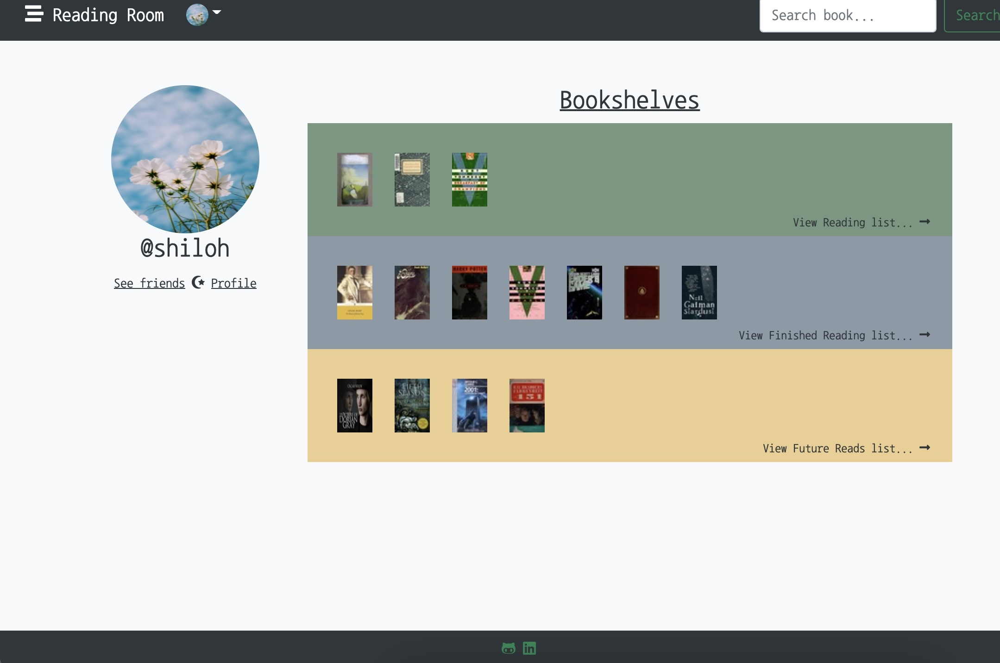
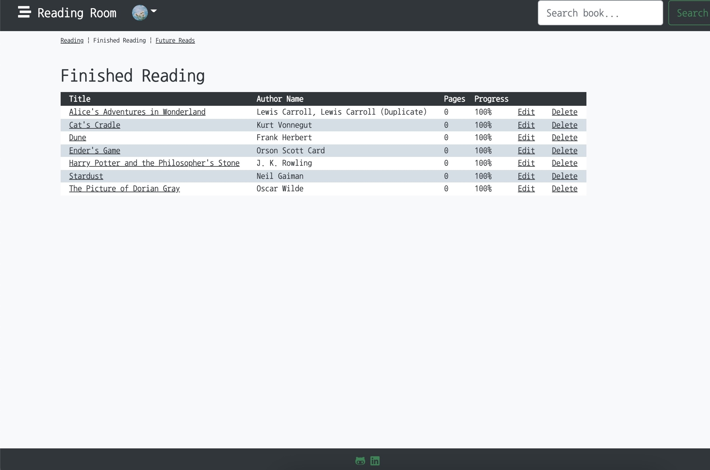
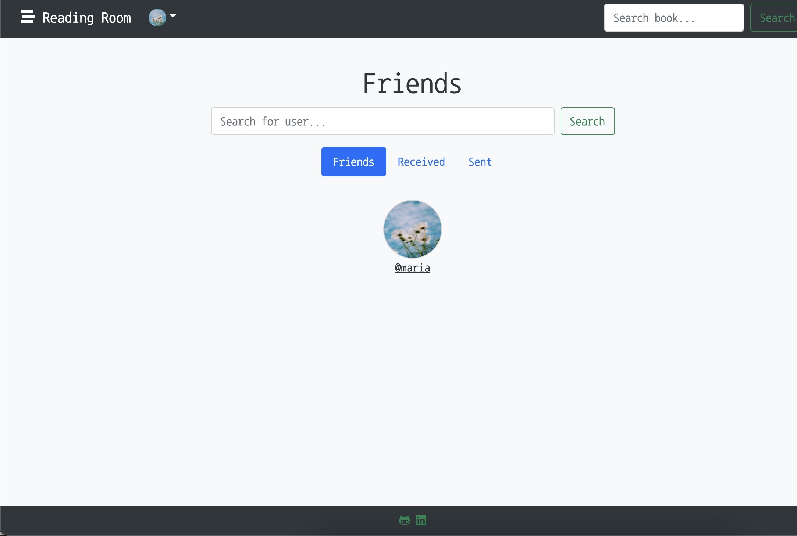

# Reading Room

**Reading Room** is a full-stack web application where book lovers are able to keep track of their books while connecting with friends. This is handy for those who want to keep an organized list of the books they have read, books they are currently reading, and books they want to read in the future. You can even track your progress!

Begin by searching for a book by its title or author. From there, you will have the option of adding a book to your shelf. Your bookshelf is accessible through your *dashboard* or your *shelves*. And of course, you can search for other users and add them as friends! If you're curious, you can take a peek at their bookshelf, too.

Reading Room uses data from the [OpenLibrary API](https://openlibrary.org/developers). It is created by Maria Acuna, who has fallen into the hole of purchasing-and-collecting-many-books-but-will-seldomly-read-one-from-start-to-finish. Within the past year she has started 7 books, and finished 1. It is a deep hole. You can find Maria on [LinkedIn](https://www.linkedin.com/in/maria-html/). If you have any curiousities, feel free to email her [here](mailto:maria.pv.acuna@gmail.com).

# Technologies

**Front-end**: HTML5, CSS, Bootstrap, JavaScript, jQuery

**Back-end**: Python, Flask, Jinja2, WTForms, PostgreSQL, Flask-SQLAlchemy, Flask-Login

# Features

1. ### Book Search

> *Users can search for a book by its title or author. If there are any results, they will be displayed with an option to either edit the current entry (if already on a user's shelf) or add the book to their bookshelf.*

2. ### Add Book to Shelf

> *Users can add a book to their bookshelf through the a book's info page. There is an option to choose between **Reading**, **Finished Reading**, or **Future Reads**. They may also add the number of pages.*

3. ### Bookshelves

> *Once a book has been added to a user's shelf, they will be able to see them displayed on their dashboard, or an organized list.*

4. ### Connect with Friends

> *Users are also able to add other users as friends! Simply use the search bar to search for another user by their username (make sure it is spelled correctly!). From there, there is an option to send a friend request to a user. Once they accept you are friends and you will have easy access to their bookshelf!*

# Deployment

This app is deployed on Heroku. Visit it [here](https://the-reading-room-app.herokuapp.com/)

# Future

There are multiple features I would like to implement in the future. Some of them include:

1. Feed that tracks latest updates from you and your friends.
2. Messaging! In browser notifications!
3. Favourites list for books
4. Customizable lists (Creating lists beyond the designated three AND the ability to design your own themed lists)

# Thank you

Thank you for visiting my humble app. I hope you enjoy it!